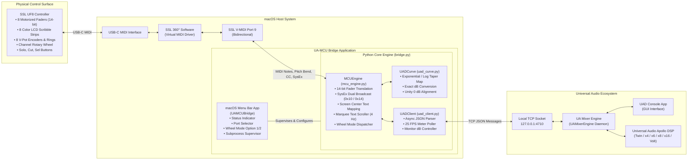

# Tactile Hardware Accessibility Bridge for UAD Apollo using SSL UF8
## Comprehensive Operator's & Technical Reference Manual

**Creator:** S&D A11y Solutions ([snda11ysolutions@gmail.com](mailto:snda11ysolutions@gmail.com))  
**Release Date:** September 24, 2026  
**License & Terms:** [MIT with Audio Safety Rider](file:///Users/jongyeonglee/Desktop/Vibe%20projects/echonav---accessible-media-manager/ua-mcu-bridge/LICENSE) | [Terms of Service](file:///Users/jongyeonglee/Desktop/Vibe%20projects/echonav---accessible-media-manager/ua-mcu-bridge/TERMS_OF_SERVICE.md)

---

> [!IMPORTANT]
> **Legal & Non-Affiliation Notice:**  
> This software is an independent interoperability and accessibility utility developed by **S&D A11y Solutions**. It is **NOT affiliated with, sponsored by, or endorsed by** Solid State Logic (SSL), Audiotonix, Universal Audio, Inc. (UAD), or LOUD Audio, LLC (Mackie). All product names and registered marks are used purely for nominative identification under fair use doctrine.

> [!CAUTION]
> **Acoustic Safety Warning:**  
> Controlling monitor volume and cue levels digitally carries acoustic risk. Always attenuate physical analog monitor controllers prior to launching the bridge to protect studio monitors and hearing.

---

## 1. System Architecture

The **Tactile Hardware Accessibility Bridge for UAD Apollo using SSL UF8** creates a seamless, low-latency, bi-directional control surface integration between the physical **Solid State Logic UF8 Advanced DAW Controller** and the **Universal Audio Apollo Console / Volt / UA Mixer Engine**.


### 1.1 Architectural Overview & Data Flow

The system operates across three primary layers: **Physical Surface**, **macOS Host Bridge**, and the **UA Audio Engine**:



### 1.2 Protocol & Communication Specifications
* **Physical Controller Interface:** High-speed USB-C MIDI class compliant.
* **Virtual MIDI Driver:** SSL 360° virtual MIDI layer (`SSL V-MIDI Port 1` through `Port 12`).
* **Control Surface Protocol:** Mackie Control Universal (MCU) and Logic Control protocol:
  * **14-bit Pitch Bend (`0xE0`–`0xE7`):** High-precision motorized fader position tracking (16,384 discrete steps).
  * **MIDI Note On/Off (`0x90`/`0x80`):** Button triggers, fader capacitive touch sense, and LED tally feedback.
  * **Control Change (`0xB0`):** Relative 2's-complement rotary encoders (V-Pots `CC 16..23`, Jog Wheel `CC 60`).
  * **SysEx Display Protocol:** 56-byte text strings broadcast simultaneously to Logic Control (`0x10`) and MCU (`0x14`) device IDs with custom dual-row screen offsets.
  * **Channel Pressure (`0xD0`):** High-frequency 4-bit nibble audio metering (16 segments, -60 dBFS to CLIP).
* **UAD Console IPC Interface:** Raw TCP socket on `127.0.0.1:4710` exchanging real-time asynchronous JSON-encoded command objects directly with the UA Mixer Engine.

---

## 2. Hardware & Software Setup Guide

### 2.1 Prerequisites
1. **Universal Audio Apollo / Volt Interface** connected and configured in Universal Audio Console.
2. **Solid State Logic UF8 Controller** connected via USB to your Mac.
3. **SSL 360° Software** installed and running on macOS.
4. **UA-MCU Bridge.app** installed in `/Applications/`.

---

### 2.2 Step 1: Configure SSL 360° Software
1. Launch **SSL 360°** on your Mac.
2. Navigate to the **UF8** configuration tab.
3. Select your desired DAW Layer (e.g., **Layer 3** is recommended to keep Layer 1 and 2 open for Pro Tools, Logic, or Ableton).
4. Set the **DAW Profile** to **Logic Pro** (or **Mackie Control**).
5. In the **MIDI Configuration** settings, verify the ports assigned to that Layer:
   * **DAW 1:** `SSL V-MIDI Port 1`
   * **DAW 2:** `SSL V-MIDI Port 5`
   * **DAW 3:** `SSL V-MIDI Port 9` *(Recommended default)*

```
+-------------------------------------------------------------+
| SSL 360° UF8 SETUP                                          |
|                                                             |
|  [ LAYER 1: Pro Tools ]   [ LAYER 2: Logic ]   [ LAYER 3 ]  |
|                                                     |       |
|  Profile: Logic Pro (MCU)                           v       |
|  MIDI Input Port:  SSL V-MIDI Port 9                        |
|  MIDI Output Port: SSL V-MIDI Port 9                        |
+-------------------------------------------------------------+
```

---

### 2.3 Step 2: Verify Universal Audio Console
1. Ensure the **UAD Console** application is running.
2. The UA Mixer Engine background daemon (`UAMixerEngine`) automatically opens and listens on local TCP port `4710`. No manual network configuration or firewall exceptions are needed as all communication is local host loopback (`127.0.0.1`).

---

### 2.4 Step 3: Launch & Operate UA-MCU Bridge
1. Open [`/Applications/UA-MCU Bridge.app`](file:///Applications/UA-MCU%20Bridge.app).
2. The fader icon will appear in the macOS top-right menu bar.
3. Click the menu bar icon:
   * **Status:** Verify that it displays **`● Running (Port 9)`**.
   * **MIDI Port:** If your SSL 360 Layer is set to Port 1 or Port 5, select the matching port from the **MIDI Port** submenu. The bridge instantly restarts on the new port without dropping audio.
   * **Channel Wheel Mode:** Select either **Option 1 (Apollo Master Monitor Volume - Default)** or **Option 2 (1-Track Navigation)**.

---

## 3. Screen Captures & Surface Overview

### 3.1 Solid State Logic UF8 Hardware Surface


### 3.2 Universal Audio Apollo Console Application


---

## 4. Deep-Dive Feature Breakdown

### 4.1 Motorized Faders with Bi-Directional Touch Automation
* **100mm Motorized Touch-Sensitive Faders (Slots 1–8):**
  * When moving a physical fader, the position is read as a 14-bit MIDI Pitch Bend message (`0xE0` + slot).
  * The raw 0–16383 position is translated into UAD's non-linear audio taper curve (`FaderLevelTapered`).
  * The bridge commands the Apollo mixer in real-time with zero audible stepping.
* **Capacitive Touch Interlock (Notes 104–111):**
  * As soon as your finger touches a fader cap, the bridge enters touch-hold mode.
  * While touched, incoming automation or external GUI fader movements from the Apollo Console will **never fight your physical hand**.
  * Upon release, the fader smoothly re-engages motor synchronization.

---

### 4.2 High-Resolution LCD Scribble Strips
Each of the 8 channel slots features a high-visibility, full-color LCD display. The bridge controls the display using dual-standard Mackie SysEx strings:

```
+---------------------------------------------------+
|  UF8 LCD Scribble Strip Layout (Single Slot)      |
|                                                   |
|   +-------------------------------------------+   |
|   |          CENTER: CHANNEL NAME             |   | <-- SysEx Offset 56 (Row 1)
|   |         (e.g., " Apollo1 " / " Vocal ")   |   |
|   +-------------------------------------------+   |
|   |          BELOW: LEVEL / STATUS            |   | <-- SysEx Offset 0 (Row 2)
|   |         (e.g., " -6.2dB " / " MUTE ")     |   |
|   +-------------------------------------------+   |
|   | ||||||| 16-Segment Live VU Meter          |   | <-- MCU Channel Pressure 0xD0
+---------------------------------------------------+
```

#### Key LCD Innovations:
1. **Screen Positioning (Center of Screen):**
   * **Row 1 (Channel Name):** Transmitted to SysEx offset **`56`**, rendering the channel title prominently in the **center** of the UF8 screen (UpLCD zone).
   * **Row 2 (dB Readout / Status):** Transmitted to SysEx offset **`0`**, positioning exact dB measurements directly **below** the channel name.
2. **Smooth Marquee Scrolling for Long Names:**
   * When a track name exceeds 7 characters (e.g. `Overhead Left`, `Apollo Virtual 1`), a background 4 Hz scrolling engine automatically engages:
     * Pauses for **1.25 seconds** at the beginning for immediate readability.
     * Smoothly scrolls through the text character-by-character.
     * Pauses for **0.75 seconds** at the end.
     * Seamlessly wraps around and repeats.
3. **Smart 8-Character Name Centering:**
   * Default Apollo names with trailing numbers (e.g. `Apollo 1`, `Analog 2`) are compressed to 7 characters (`Apollo1`, `Analog2`) so they center symmetrically without triggering unnecessary marquee scrolling.
4. **Temporary HUD Banners:**
   * Switching wheel modes or adjusting monitor levels displays a centered, high-contrast on-screen banner (e.g. `>>> MONITOR: -18.0 dB <<<`) for 1.5 seconds before restoring channel dB values.

---

### 4.3 Rotary V-Pot Encoders & LED Rings
* **Pan Positioning (CC 16–23):**
  * Rotating a V-Pot adjusts channel stereo pan in relative 2's-complement steps.
  * The current pan position is rendered on the UF8's circular 11-segment LED ring (CC 48–55) and formatted on the screen (e.g., ` L 35 `, `  C  `, ` R 50 `).
* **V-Pot Push (Notes 32–39):**
  * Pressing the top of any V-Pot instantly snaps pan back to dead-center (`0.0`).

---

### 4.4 Channel Rotary Wheel: Dual Operating Modes
The large brushed metal encoder on the right side of the UF8 can be toggled between two distinct operating modes:

```
+-------------------------------------------------------------------------+
| CHANNEL ROTARY WHEEL OPERATING MODES                                    |
|                                                                         |
| [ Push / Click Wheel or Select in Menu Bar ]                            |
|                                                                         |
| OPTION 1: Apollo Master Monitor Volume (Default)                        |
|   • Turn Wheel Clockwise: Increases Master Monitor Volume by +1.0 dB.   |
|   • Turn Wheel Counter-Clockwise: Decreases Monitor Volume by -1.0 dB.  |
|   • Real-Time HUD banner pops up on UF8 LCD: ">>> MONITOR: -24.0 dB <<<"|
|                                                                         |
| OPTION 2: 1-Track Navigation                                            |
|   • Turn Wheel Clockwise: Shifts channel bank right by 1 track.         |
|   • Turn Wheel Counter-Clockwise: Shifts channel bank left by 1 track.  |
+-------------------------------------------------------------------------+
```

#### How to Switch Modes:
* **Hardware:** Push/click down on the Channel Rotary Wheel (Notes 84, 100, 101, 79).
* **Software:** Open the macOS Menu Bar icon and select **Option 1** or **Option 2** under the **Channel Wheel** submenu.

---

### 4.5 Bank & Channel Navigation Controls
* **Page Buttons (`< PAGE >` Notes 48 / 49, 104 / 105, 44 / 45):**
  * Moves the active 8-fader surface in discrete **8-channel page jumps** (e.g., Channels 1–8 $\rightarrow$ Channels 9–16 $\rightarrow$ Channels 17–24 $\rightarrow$ Channels 25–27).
  * Automatically announces the channel span (e.g., "Apollo 1 through QC", "TALKBACK through AUX 2") or boundary status ("First page", "Last page").
* **Bank Buttons (`< BANK >` Notes 46 / 47):**
  * Nudges the fader bank by **1 single track step** at a time (e.g., Channels 1–8 $\rightarrow$ Channels 2–9 $\rightarrow$ Channels 3–10), allowing precise alignment of any input or aux track to fader 1.
  * Reaching edges announces "Start of tracks" or "End of tracks".
* **Channel Wheel (Large Master Encoder):**
  * In **Option 1 (Apollo Master Volume - Default)**, rotating the encoder trims Apollo Main Monitor Volume $\pm 1.0\text{ dB}$.
  * In **Option 2 (Track Navigation)**, rotating the encoder nudges the active bank by 1 single track step.

#### Channel Layout & Aux Return Mapping:
* **Active Input Channels:** Discovers all hardware and virtual Apollo inputs (Mic/Line, ADAT, S/PDIF, Virtual, and TALKBACK).
* **Automatic `N/A` Filtering:** Automatically filters out unused DSP matrix placeholder slots (such as `N/A 1`).
* **Master AUX 1 & AUX 2 Returns:** Placed directly after `TALKBACK` on the mixer surface. You can bank right to them to control Aux 1 and Aux 2 master return levels with motorized faders, toggle Mute, and monitor real-time peak/RMS meter ladder LEDs. In Cue Send mode (CUE 1–4), Aux return sends to Cues can also be controlled on faders.

---

### 4.6 Channel Strip Buttons & Advanced Select Gestures
* **SOLO Buttons (Notes 8–15):** Toggles channel solo with dedicated amber tally LED.
* **MUTE / CUT Buttons (Notes 16–23):** Toggles channel mute with dedicated red tally LED.
* **SEL (Select) Buttons (Notes 24–31) with Smart Multi-Function Gestures:**
  1. **Single-Tap:** Selects the channel track in Console; illuminates the white SEL tally LED.
  2. **Double-Tap (Fader 0 dB Reset):** Double-tapping SEL snaps the motorized fader instantly to **`0.0 dB` (Unity Gain)**.
  3. **Long-Press (> 0.5s):** Holding SEL down for half a second drops the fader smoothly to **`-oo dB` (Lowest Level)**.

---

### 4.7 Sends on Faders (FLIP Mode) — Full AUX & CUE Cycling
Pressing the **`FLIP`** button (Note 50) transforms the entire 8-channel surface into a dedicated send mixer:

```
MAIN MIX (Normal)
      │
      ▼ [Press FLIP]
   AUX 1  (Motorized faders show AUX 1 send level; V-Pots adjust send pan)
      │
      ▼ [Press FLIP]
   AUX 2  (Motorized faders show AUX 2 send level; V-Pots adjust send pan)
      │
      ▼ [Press FLIP]
   CUE 1  (Headphone / Artist Cue 1 send mix)
      │
      ▼ [Press FLIP]
   CUE 2  (Headphone / Artist Cue 2 send mix)
      │
      ▼ [Press FLIP]
   CUE 3  (Cue 3 send mix)
      │
      ▼ [Press FLIP]
   CUE 4  (Cue 4 send mix)
      │
      ▼ [Press FLIP]
MAIN MIX (Normal fader mix restored)
```

* **Visual Indication:** The FLIP button LED glows amber whenever a send mode is active.
* **LCD Indication:** Channel names are prefixed with the active send bus (e.g., `A1:Kick`, `C1:Vocal`, `C1:AUX1`).
* **Aux 1 & Aux 2 Cue Sends:** In CUE modes (`CUE 1` through `CUE 4`), the AUX 1 and AUX 2 tracks on your surface actively control the reverb/delay Aux return sends into those headphone cue mixes, including motorized fader level and MUTE bypass toggling. In AUX modes (`AUX 1` / `AUX 2`), Aux tracks show `---` to prevent impossible Aux-to-Aux routing.
* **Mute as Send Bypass:** In FLIP mode, the MUTE button toggles send bypass instead of channel mute.
* **Direct Return to Main Mix & First Channel (Double-Press):** Double-pressing the **`FLIP`** button at any time instantly snaps the entire surface straight back to the Main Mix and jumps directly to the first channel (Tracks 1–8), without needing to cycle through all remaining cue buses.

### 4.8 TALKBACK Channel & Studio Communication Control
The bridge provides complete hands-on hardware control over the Apollo hardware **Talkback** microphone, enabling engineers to manage slate and studio communication without reaching for a mouse:

* **Automatic Talkback Discovery:** The bridge identifies the hardware Apollo Talkback channel (`TALKBACK`) from the UA Mixer Engine and integrates it seamlessly into the mixer surface.
* **Surface Layout & Filtering:** 
  * Positioned immediately following all tracking inputs and directly preceding Master `AUX 1` and `AUX 2` returns (e.g., Channel 25 in a standard 27-channel configuration).
  * Automatically filters out internal DSP matrix dummy slots (such as `N/A 1`), ensuring Talkback and Aux returns remain directly accessible on the same 8-fader bank (Channels 25–27).
* **Motorized Level Control:** Physical 100mm motorized fader tracks and sets the Talkback microphone level in Apollo Console with 14-bit pitch bend precision.
* **Hardware Mute / Talkback Engage:** The channel **MUTE** button acts as a tactile Talkback Mute switch with an instant red tally LED indicator and voice confirmation (*"TALKBACK muted"* / *"TALKBACK unmuted"*).
* **Select Gestures:** 
  * **Double-Tap SEL:** Snaps the Talkback level instantly to **`0.0 dB` (Unity Gain)**.
  * **Long-Press SEL (> 0.5s):** Drops the Talkback level smoothly to **`-oo dB` (Muted Floor)**.
* **Live Hardware VU Metering:** Streams real-time speech level metering to the scribble strip 16-segment LED ladder, allowing immediate visual and tactile confirmation of slate voice levels.
* **Non-Visual Speech Feedback:** Announces Talkback status clearly (*"TALKBACK, -12.0 d B"*, *"TALKBACK through AUX 2"*) so blind engineers always know when communication is live.

### 4.9 Preamp Focus / Channel Inspector Mode (Concept 1: Unison Preamp & Hardware Controls)
Pressing the **`CHANNEL`** button (Note 40) or **`PLUG-IN`** button (Note 43) expands the selected Apollo track across all 8 physical fader slots on the SSL UF8. This dedicated inspector mode gives recording engineers tactile, physical control over Universal Audio analog preamps and Unison modeling technology:

```
[Slot 1]       [Slot 2]       [Slot 3]       [Slot 4]       [Slot 5]       [Slot 6]       [Slot 7]       [Slot 8]
 PREAMP         +48V            PAD           LOWCUT          PHASE         SOURCE         OUTPUT         UNISON
+35.0dB        +48V ON        -20 dB          75 Hz          NORMAL          MIC           0.0 dB         ACTIVE
(Motor Fader)  (Double-Tap)   (Pad Toggle)   (Filter Cut)   (Polarity Ø)   (Mic/Line)     (Track Vol)    (DSP Bypass)
```

* **Surface Layout Across 8 Physical Slots:**
  1. **Slot 1 (Preamp Gain):** Motorized 100mm fader provides continuous 14-bit tactile tracking of Apollo analog hardware gain (+10.0 to +65.0 dB). V-Pot 1 provides fine rotary trim (+/- 1.0 dB per tick) with LED ring position, and pushing V-Pot 1 resets gain to minimum (+10.0 dB).
  2. **Slot 2 (+48V Phantom Power with Safety Double-Tap Interlock):**
     * **Safety Protection for Delicate Ribbon & Vintage Microphones:** Turning ON +48V requires a deliberate double-tap on Mute 2 or SEL 2 within 0.85 seconds. The first tap triggers an immediate spoken warning: *"Warning: Press again to confirm 48 volt phantom power"*. A second tap confirms and engages phantom power (*"Plus 48 volts enabled"*).
     * **Immediate Disengagement:** Turning OFF +48V requires only a single tap (*"Plus 48 volts off"*).
     * Mute 2 tally LED illuminates vibrant RED when +48V is engaged.
  3. **Slot 3 (-20 dB Pad):** Mute 3 or SEL 3 toggles the hardware input attenuation pad with voice confirmation (*"Pad minus 20 d B on"* / *"Pad off"*) and RED tally LED.
  4. **Slot 4 (High-Pass / Low-Cut Filter - 75 Hz):** Mute 4 or SEL 4 engages Apollo's 75 Hz high-pass filter (*"Low cut filter 75 Hertz on"* / *"Low cut off"*).
  5. **Slot 5 (Phase Invert - Ø):** Mute 5 or SEL 5 toggles phase polarity invert (*"Phase inverted"* / *"Phase normal"*).
  6. **Slot 6 (Input Source: Mic vs. Line vs. Hi-Z):** Mute 5, SEL 5, or rotating V-Pot 5 toggles the input source between Mic and Line. If an electric guitar or bass is physically plugged into the Apollo front-panel Hi-Z jack, the bridge automatically reports *"Hi-Z instrument input locked by front panel jack"*.
  7. **Slot 7 (Output Channel Level & Pan):** Motorized fader 7 tracks the channel output fader. V-Pot 7 adjusts channel pan (pushing V-Pot 7 centers pan). Mute 7 mutes channel output, and double-tapping SEL 7 resets output level to 0.0 dB.
  8. **Slot 8 (Unison Analog Modeling Plug-in):** Displays the loaded Unison plug-in name (e.g. `610-B`, `NEVE107`, `API-VIS`). Mute 8 or SEL 8 toggles Unison DSP power/bypass (*"UA 610-B active"* / *"UA 610-B bypassed"*). If no Unison plug-in is inserted, the LCD displays `EMPTY` and announces *"No Unison plugin inserted"*.

* **Channel Stepping in Preamp Focus Mode:**
  * While in Preamp Focus Mode, pressing **`< BANK >`** (Notes 46/47) or **`< PAGE >`** (Notes 48/49), or rotating the Master Jog Wheel, steps directly between analog preamp channels (e.g., Apollo 1 $\longleftrightarrow$ Apollo 2) with voice announcements (*"Focused on Apollo 2"*).
  * The entire 8-fader surface instantly updates to reflect the newly selected preamp channel.

* **Exiting Preamp Focus Mode:**
  * Pressing **`CHANNEL`** (Note 40) or **`PLUG-IN`** (Note 43) exits focus mode and returns to standard 8-channel mix view.
  * **Emergency Double-Press FLIP:** Double-pressing the **`FLIP`** button at any time instantly escapes Preamp Focus Mode and returns straight to the Main Mix at Track 1.

---

### 4.10 Real-Time Hardware VU Level Metering
* **25 FPS Polling Engine:** A lightweight background thread queries live audio input meters (`/devices/0/inputs/{ch}/meters/0`) from the UA Mixer Engine.
* **Hardware LED Ladders:** Streams MCU Channel Pressure packets (`0xD0`) to illuminate the physical VU meters on the UF8 scribble strip.
* **Acoustically Calibrated Scale:** Perfectly calibrated to Apollo Console markings:
  * `-oo`, `-60 dB`, `-46 dB`, `-36 dB`, `-27 dB`, `-21 dB`, `-18 dB`, `-15 dB`, `-12 dB`, `-9 dB`, `-6 dB`, `-3 dB`, `0 dB`, and `CLIP` red overload indicator.

---

### 4.11 Native macOS Menu Bar Application
The native Swift application provides an unobtrusive menu bar status item:

```
[slider.vertical.3 icon]
 ├── UA-MCU Bridge (Bold Title)
 ├── ● Running (Port 9) [Status in Green]
 ├── Stop Bridge / Restart Bridge
 ├── ─────────────────────────────
 ├── Voice Guidance: ON (Speaks channels & levels) >
 │    ├── Voice Guidance: Enabled (ON) [✔]
 │    └── Voice Guidance: Disabled (OFF)
 ├── MIDI Port: SSL V-MIDI Port 9  >
 │    ├── Port 1 (SSL 360 DAW 1)
 │    ├── Port 5 (SSL 360 DAW 2)
 │    └── Port 9 (SSL 360 DAW 3) [✔]
 ├── Channel Wheel: Apollo Monitor Vol >
 │    ├── Option 1: Apollo Master Monitor Volume (Default) [✔]
 │    └── Option 2: Track Navigation (1-Track Step)
 ├── ─────────────────────────────
 ├── Live Terminal Monitor... (Opens interactive terminal monitor)
 ├── Open Log File... (Opens ~/Library/Logs/UAMCUBridge.log)
 ├── Open Bridge Directory...
 └── Quit UA-MCU Bridge
```

---

### 4.12 Built-In Voice Guidance & Non-Visual Speech Feedback (Accessibility)
To empower blind and low-vision audio engineers to mix, record, and navigate without requiring sight or even enabling macOS system VoiceOver, the bridge features a built-in, low-latency asynchronous speech synthesis system (`VoiceAnnouncer`):
* **Self-Contained & Independent:** Uses macOS native `/usr/bin/say` at an optimized pace (`-r 210`) without any third-party screen reader requirement.
* **Concise Decibel Pronunciation:** Automatically speaks "dB" as the concise letters **"d B"** (*"dee bee"*) rather than expanding to the lengthy word *"decibels"*, maximizing speed and clarity during active mixing.
* **Zero Audio/MIDI Latency:** Speech operates completely asynchronously in isolated non-blocking subprocesses. Moving faders, rotating knobs, or receiving meter packets is never delayed.
* **Instant Interruption & Debouncing:** Fast gestures immediately cancel previous utterances so spoken feedback never falls behind, and rapid continuous adjustments (such as spinning the monitor volume wheel) automatically debounce (350ms) to speak only the settled final value.
* **Dynamic Menu Bar Toggle:** Can be toggled ON or OFF at any time via the macOS Menu Bar under **Voice Guidance**. Settings are preserved persistently in `~/.uamcu_config.json`.

#### Spoken Interactions Table:
| Hardware Trigger | Action / Gesture | Spoken Feedback Example |
| :--- | :--- | :--- |
| **SEL Button (Tap)** | Channel Selection | *"Vocal, -6.2 d B, center"* or *"TALKBACK, 0 d B, muted"* |
| **SEL Button (Double-Tap)** | Snap Fader to 0 dB Unity | *"Vocal reset to zero d B"* / *"TALKBACK reset to zero d B"* |
| **SEL Button (Long-Press)** | Snap Fader to -oo dB Floor | *"Vocal set to minus infinity"* / *"TALKBACK set to minus infinity"* |
| **V-Pot Push** | Snap Pan to Dead Center | *"Vocal pan centered"* |
| **MUTE Button** | Toggle Mute | *"Vocal muted"* / *"Vocal unmuted"* / *"TALKBACK unmuted"* |
| **SOLO Button** | Toggle Solo | *"Vocal solo on"* / *"Vocal solo off"* |
| **FLIP Button (Single-Tap)** | Cycle Send Bus Modes | *"Aux 1 sends on faders"* / *"Cue 1 sends on faders"* / *"Main mix"* |
| **FLIP Button (Double-Tap)** | Return to Main Mix & First Channel | *"Main mix, Apollo 1 through QC"* / *"Main mix"* |
| **Wheel Push / Click** | Toggle Wheel Mode | *"Channel wheel: Apollo Monitor Volume"* / *"Track Navigation"* |
| **Channel Wheel Nudge** | Adjust Monitor Volume | *"Monitor -18.0 d B"* / *"Monitor maximum 0 d B"* |
| **< PAGE > Buttons** | 8-Channel Page Jump | *"Apollo 1 through QC"* / *"TALKBACK through AUX 2"* |
| **< BANK > Buttons** | 1-Track Single Step | *"Apollo 2 through Neve 1"* |
| **Page / Bank Edges** | Boundary Reached | *"First page"* / *"Last page"* / *"Start of tracks"* / *"End of tracks"* |
| **Startup / Connection** | Bridge Launch | *"Tactile Accessibility Bridge connected. Voice guidance enabled."* |

---

## 5. Technical Reference & Protocol Specification

### 5.1 MIDI Note Assignment Table
| Function | Note Number (Dec) | Note Number (Hex) | Direction | Action / Meaning |
| :--- | :--- | :--- | :--- | :--- |
| **Solo Buttons (Ch 1–8)** | 8 – 15 | `0x08` – `0x0F` | Bidirectional | Note On (down) / Note Off (up) + LED Tally |
| **Mute / Cut Buttons (Ch 1–8)** | 16 – 23 | `0x10` – `0x17` | Bidirectional | Toggle Mute or Send Bypass + LED Tally |
| **Select Buttons (Ch 1–8)** | 24 – 31 | `0x18` – `0x1F` | Bidirectional | Single (Select), Double (0 dB), Long (-oo dB) |
| **V-Pot Push (Ch 1–8)** | 32 – 39 | `0x20` – `0x27` | Inbound | Resets Pan to Center (`0.0`) |
| **Page Left / Right** | 48 / 49, 104 / 105, 44 / 45 | `0x30`/`0x31`, `0x68`/`0x69`, `0x2C`/`0x2D` | Inbound | Shifts bank by 8-channel pages (1-8, 9-16...) |
| **Bank Left / Right** | 46 / 47, 98 / 99 | `0x2E`/`0x2F`, `0x62`/`0x63` | Inbound | Nudges bank by 1 single track step |
| **FLIP Button** | 50 | `0x32` | Bidirectional | Single: Cycle Main $\rightarrow$ Aux 1/2 $\rightarrow$ Cue 1–4; Double: Direct Main Mix |
| **Wheel Click / Push** | 84, 100, 101, 79 | `0x54`, `0x64`, etc. | Inbound | Toggles Wheel Mode (Option 1 $\leftrightarrow$ Option 2) |
| **Fader Touch Sense (Ch 1–8)**| 104 – 111 | `0x68` – `0x6F` | Inbound | Capacitive touch hold (disables motor fighting)|

### 5.2 MIDI Control Change (CC) Table
| CC Number (Dec) | CC Number (Hex) | Purpose | Range / Value |
| :--- | :--- | :--- | :--- |
| **CC 16 – 23** | `0x10` – `0x17` | Rotary V-Pot Rotation | Relative 2's complement (`0x01..0x3F` pos, `0x41..0x7F` neg) |
| **CC 48 – 55** | `0x30` – `0x37` | V-Pot LED Ring Display | Values `0x01` to `0x0B` (11-segment arc) |
| **CC 60** | `0x3C` | Channel Rotary Wheel | Relative 2's complement (Jog/Scrub rotation) |

### 5.3 Pitch Bend & Channel Pressure Table
| Status Byte | Sub-Channel | Data Bytes | Purpose |
| :--- | :--- | :--- | :--- |
| **`0xE0` – `0xE7`** | Slots 0 – 7 | `LSB (0..127)`, `MSB (0..127)` | 14-bit Motorized Fader Position (0 to 16,383) |
| **`0xD0`** | Surface | `(Slot << 4) \| MeterNibble` | 4-bit VU audio meter segment (`0x0` to `0xE`) |

### 5.4 SysEx Display Commands
* **Global Meter Enable:** `F0 00 00 66 [0x10/0x14] 21 01 F7`
* **Slot Meter Enable:** `F0 00 00 66 [0x10/0x14] 20 [Slot] 03 F7`
* **Row 1 (Center Channel Names):** `F0 00 00 66 [0x10/0x14] 12 38 [56 ASCII Chars] F7` *(Offset 0x38 = 56)*
* **Row 2 (Below dB Readout):** `F0 00 00 66 [0x10/0x14] 12 00 [56 ASCII Chars] F7` *(Offset 0x00 = 0)*

---

## 6. Troubleshooting & Diagnostics

### 6.1 Faders or LCD Not Responding
1. **Check SSL 360 Port Assignment:** Open SSL 360 and confirm which DAW layer is active. Ensure the port matches the port selected in the Menu Bar app (default is **Port 9**).
2. **Restart Bridge Daemon:** Click the menu bar icon and select **Restart Bridge**.

### 6.2 UAD Console Not Connecting
1. Verify Universal Audio Console is running.
2. In Terminal, test if the UA Mixer Engine socket is listening:
   ```bash
   nc -zv 127.0.0.1 4710
   ```
   If it responds `Connection to 127.0.0.1 port 4710 [tcp/*] succeeded!`, the audio engine is healthy.

### 6.3 Checking Live Bridge Logs
* Select **Open Log File...** from the menu bar app to open `~/Library/Logs/UAMCUBridge.log`.
* Alternatively, select **Live Terminal Monitor...** to open an interactive real-time readout of all fader moves, SysEx traffic, and VU levels.

---

## 7. Legal Notices, Terms of Service & Disclaimers

### 7.1 Creator Attribution
* **Developer:** S&D A11y Solutions
* **Contact:** [snda11ysolutions@gmail.com](mailto:snda11ysolutions@gmail.com)
* **Release Date:** September 24, 2026
* **Full Legal Terms:** See [`TERMS_OF_SERVICE.md`](file:///Users/jongyeonglee/Desktop/Vibe%20projects/echonav---accessible-media-manager/ua-mcu-bridge/TERMS_OF_SERVICE.md)

### 7.2 Non-Affiliation Disclaimer
S&D A11y Solutions is an independent third-party entity and is **not affiliated, associated, authorized, endorsed by, or in any way officially connected** with Solid State Logic (SSL), Audiotonix, Universal Audio, Inc. (UAD), or LOUD Audio, LLC (Mackie). All product names, logos, and brands (e.g. *SSL UF8*, *SSL 360°*, *Universal Audio*, *Apollo*, *UAD Console*, *Mackie Control Universal*) are property of their respective owners and are used strictly under fair use for interoperability identification.

### 7.3 Acoustic & Monitoring Safety Notice
Digital control of audio levels, monitor buses, and cue outputs carries inherent acoustic risks. S&D A11y Solutions disclaims all liability for hearing damage, speaker blowout, or physical hardware wear resulting from high volume levels, feedback loops, or motorized fader movement. Always lower external monitor controllers before testing gain changes.

### 7.4 "AS-IS" Software Warranty
This software is provided "AS IS", without warranty of any kind, express or implied. Under no circumstances shall S&D A11y Solutions be liable for any lost studio time, corrupted audio sessions, or commercial damages.

