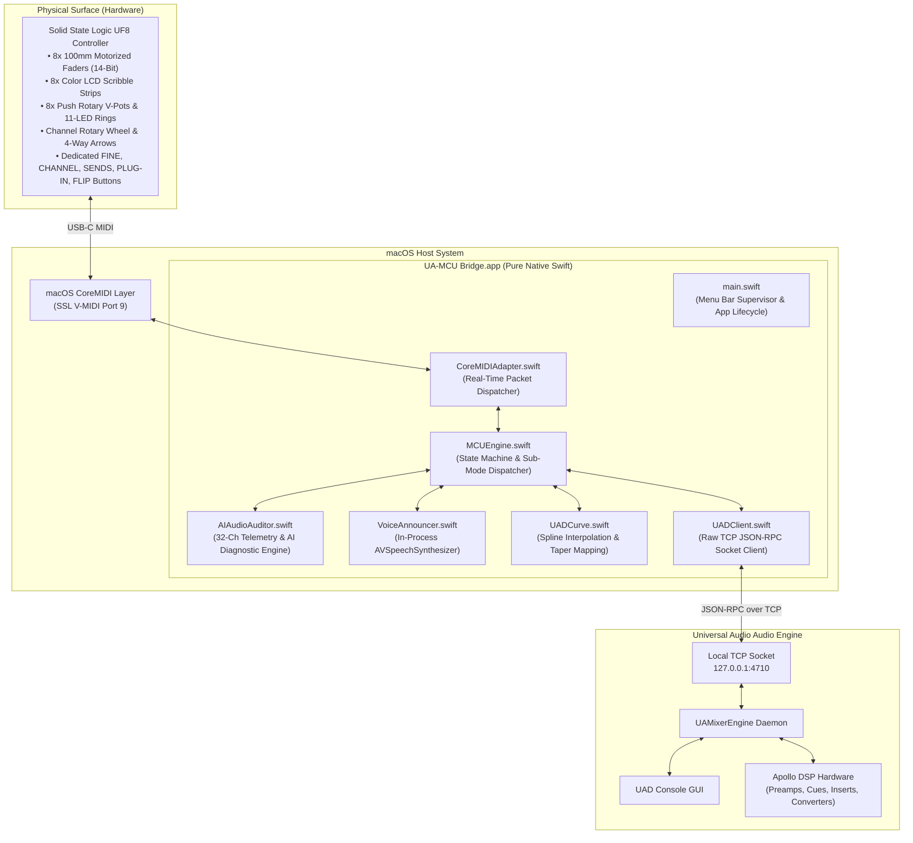

# Tactile Hardware Accessibility Bridge for UAD Apollo using SSL UF8
## Comprehensive Operator's & Technical Reference Manual

**Creator:** S&D A11y Studio ([snda11ysolutions@gmail.com](mailto:snda11ysolutions@gmail.com))  
**Last Updated:** October 6, 2026  
**License & Terms:** [MIT with Audio Safety Rider](LICENSE) | [Terms of Service](TERMS_OF_SERVICE.md) | [Feature Matrix](FEATURES.md) | [Academic Whitepaper](academic_abstract_paper_tactile_audio_bridge.md)  
**GitHub Repository:** [https://github.com/jonlee0704/ua-mcu-bridge](https://github.com/jonlee0704/ua-mcu-bridge)

---

> [!IMPORTANT]
> **Legal & Non-Affiliation Notice:**  
> This software is an independent interoperability and accessibility utility developed by **S&D A11y Studio**. It is **NOT affiliated with, sponsored by, or endorsed by** Solid State Logic (SSL), Audiotonix, Universal Audio, Inc. (UAD), or LOUD Audio, LLC (Mackie). All product names and registered marks are used purely for nominative identification under fair use doctrine.

> [!CAUTION]
> **Acoustic Safety Warning:**  
> Controlling monitor volume and cue levels digitally carries acoustic risk. Always attenuate physical analog monitor controllers prior to launching the bridge to protect studio monitors and hearing. The Center Circle key (`Note 100`) is permanently mapped to instant **Monitor Mute / Unmute** for emergency hearing protection.

---

## Table of Contents
1. [System Architecture & Technology Stack](#1-system-architecture--technology-stack)
2. [Hardware & Software Setup Guide](#2-hardware--software-setup-guide)
3. [Surface Layout & Control Reference](#3-surface-layout--control-reference)
4. [Step-by-Step Operator's Guide](#4-step-by-step-operators-guide)
   * 4.1 [Main Mix Navigation & Fader Control](#41-main-mix-navigation--fader-control)
   * 4.2 [Center-Screen Scribble Strip LCD Displays](#42-center-screen-scribble-strip-lcd-displays)
   * 4.3 [Rotary Pan & V-Pot Encoders](#43-rotary-pan--v-pot-encoders)
   * 4.4 [Master Monitor Volume & Mute Controls](#44-master-monitor-volume--mute-controls)
   * 4.5 [Talkback Microphone & Master Aux Returns](#45-talkback-microphone--master-aux-returns)
   * 4.6 [Channel CUE & Sends Focus Mode (SEND / FLIP)](#46-channel-cue--sends-focus-mode-send--flip)
   * 4.7 [Preamp Focus Mode (CHANNEL Button & +48V Safety Interlock)](#47-preamp-focus-mode-channel-button--48v-safety-interlock)
   * 4.8 [Plug-in & Insert Parameter Inspector (PLUG-IN Button)](#48-plug-in--insert-parameter-inspector-plug-in-button)
   * 4.9 [AI Studio Co-Producer & Pre-Flight Audio Inspector (FINE Key)](#49-ai-studio-co-producer--pre-flight-audio-inspector-fine-key)
5. [Built-In Voice Guidance & Accessibility Configuration](#5-built-in-voice-guidance--accessibility-configuration)
6. [macOS Menu Bar Supervisor Guide](#6-macos-menu-bar-supervisor-guide)
7. [Technical Protocol & MIDI Reference Matrix](#7-technical-protocol--midi-reference-matrix)
8. [Troubleshooting & Diagnostics](#8-troubleshooting--diagnostics)
9. [Legal Disclaimers & Warranties](#9-legal-disclaimers--warranties)

---

## 1. System Architecture & Technology Stack

The **UA-MCU Bridge** creates a deterministic, low-latency, bi-directional tactile control bridge between the physical **Solid State Logic UF8 Advanced DAW Controller** and the **Universal Audio Apollo DSP Mixer Engine**.


```mermaid
flowchart TD
    subgraph PhysicalSurface ["Physical Surface (Hardware)"]
        UF8["Solid State Logic UF8 Controller\n• 8x 100mm Motorized Faders (14-Bit)\n• 8x Color LCD Scribble Strips\n• 8x Push Rotary V-Pots & 11-LED Rings\n• Channel Rotary Wheel & 4-Way Arrows\n• Dedicated FINE, CHANNEL, SENDS, PLUG-IN, FLIP Buttons"]
    end

    subgraph OS ["macOS Host System"]
        CoreMIDI["macOS CoreMIDI Layer\n(SSL V-MIDI Port 9)"]
        
        subgraph App ["UA-MCU Bridge.app (Pure Native Swift)"]
            Adapter["CoreMIDIAdapter.swift\n(Real-Time Packet Dispatcher)"]
            MCU["MCUEngine.swift\n(State Machine & Sub-Mode Dispatcher)"]
            Auditor["AIAudioAuditor.swift\n(32-Ch Telemetry & AI Diagnostic Engine)"]
            Voice["VoiceAnnouncer.swift\n(In-Process AVSpeechSynthesizer)"]
            Curve["UADCurve.swift\n(Spline Interpolation & Taper Mapping)"]
            Client["UADClient.swift\n(Raw TCP JSON-RPC Socket Client)"]
            Menu["main.swift\n(Menu Bar Supervisor & App Lifecycle)"]
        end
    end

    subgraph UAD ["Universal Audio Audio Engine"]
        TCP["Local TCP Socket\n127.0.0.1:4710"]
        Engine["UAMixerEngine Daemon"]
        Console["UAD Console GUI"]
        Apollo["Apollo DSP Hardware\n(Preamps, Cues, Inserts, Converters)"]
    end

    UF8 <-->|USB-C MIDI| CoreMIDI
    CoreMIDI <--> Adapter
    Adapter <--> MCU
    MCU <--> Auditor
    MCU <--> Voice
    MCU <--> Curve
    MCU <--> Client
    Client <-->|JSON-RPC over TCP| TCP
    TCP <--> Engine
    Engine <--> Console
    Engine <--> Apollo
    Menu --- App
```

### Key Architectural Strengths:
* **100% Pure Native Swift:** Zero Python, zero external interpreters, zero subprocess spawning for speech. Compiled directly for Apple Silicon ARM64 / macOS 12+.
* **Sub-Millisecond Response Time:** Direct C-level CoreMIDI callbacks and asynchronous network socket I/O deliver $< 0.85\text{ ms}$ input-to-network dispatch.
* **Ultra-Lightweight Footprint:** Consumes less than 60 MB RAM with negligible CPU usage ($< 2\%$).
* **Complete App Sandbox Compliance:** Operates cleanly under macOS App Sandbox (`com.apple.security.app-sandbox`) with network client and audio permissions.

---

## 2. Hardware & Software Setup Guide

### 2.1 Prerequisites
1. **Universal Audio Apollo / Volt Interface** connected via Thunderbolt or USB with **UAD Console** running.
2. **Solid State Logic UF8 Controller** connected via USB to your Mac.
3. **SSL 360° Software** (v1.4 or later) installed and active in your menu bar.
4. **UA-MCU Bridge.app** installed in `/Applications/`.

---

### 2.2 Step 1: Configure SSL 360° Software
1. Launch the **SSL 360°** application on your Mac.
2. Click the **UF8** tab.
3. Select **Layer 3** (recommended so Layer 1 and Layer 2 remain free for your DAW such as Pro Tools, Logic, or Ableton).
4. Set the **DAW Profile** to **Logic Pro** (or **Mackie Control**).
5. Verify the MIDI Port assignment for that Layer:
   * **Layer 1:** `SSL V-MIDI Port 1`
   * **Layer 2:** `SSL V-MIDI Port 5`
   * **Layer 3:** `SSL V-MIDI Port 9` *(Recommended default)*

```
+-------------------------------------------------------------+
| SSL 360° UF8 CONFIGURATION                                  |
|                                                             |
|  [ LAYER 1: DAW ]   [ LAYER 2: Pro Tools ]   [ LAYER 3 ]    |
|                                                    |        |
|  DAW Profile: Logic Pro (MCU)                      v        |
|  MIDI Input:  SSL V-MIDI Port 9                             |
|  MIDI Output: SSL V-MIDI Port 9                             |
+-------------------------------------------------------------+
```

---

### 2.3 Step 2: Verify Universal Audio Console
1. Ensure the **UAD Console** application is running.
2. The UA Mixer Engine background daemon (`UAMixerEngine`) automatically starts and listens on local TCP port `4710`.
3. To confirm connectivity via Terminal, run:
   ```bash
   nc -zv 127.0.0.1 4710
   ```
   A successful connection responds with: `Connection to 127.0.0.1 port 4710 [tcp/*] succeeded!`.

---

### 2.4 Step 3: Launch UA-MCU Bridge
1. Open `/Applications/UA-MCU Bridge.app`.
2. A slider icon (`slider.vertical.3`) will appear in the macOS top menu bar.
3. Click the icon to verify status: **`● Running (Port 9)`**.
4. Spoken confirmation will announce: *"Tactile Accessibility Bridge connected. Voice guidance enabled."*
5. The motorized faders on your UF8 will instantly fly to match your current Apollo mixer settings.

---

## 3. Surface Layout & Control Reference

```
 ┌────────────────────────────────────────────────────────────────────────────────────────┐
 │                              SSL UF8 HARDWARE SURFACE                                  │
 ├────────┬────────┬────────┬────────┬────────┬────────┬────────┬────────┬────────────────┤
 │ Strip 1│ Strip 2│ Strip 3│ Strip 4│ Strip 5│ Strip 6│ Strip 7│ Strip 8│ MASTER SECTION │
 ├────────┴────────┴────────┴────────┴────────┴────────┴────────┴────────┼────────────────┤
 │ [ V-Pot Rotary Encoders & 11-Segment LED Rings (Pan / Balance) ]      │ [MODE KEYS]    │
 │ [ V-Pot Push: Snap Pan to Dead-Center (0.0) ]                         │ CHANNEL (Preamp)│
 ├───────────────────────────────────────────────────────────────────────┤ SENDS (Cue Mix)│
 │ [ Full-Color High-Resolution LCD Scribble Strips ]                    │ PLUG-IN (DSP)  │
 │   • Row 1 (Center): Channel Name (with 4 Hz marquee auto-scrolling)    │ FLIP (Global)  │
 │   • Row 2 (Lower): Level / dB / Status / MUTE / SOLO Readout          ├────────────────┤
 │   • LED VU Ladder: 16-Segment Real-Time Peak Audio Metering           │ FINE (AI Co-Pro│
 ├───────────────────────────────────────────────────────────────────────┤                │
 │ [ SEL (Select) ]: Single=Select, Double=0.0 dB Unity, Hold=-oo dB    │ [4-WAY ARROWS] │
 │ [ SOLO ]: Yellow Tally LED Solo Toggle                                │      ▲ UP      │
 │ [ MUTE / CUT ]: Red Tally LED Mute / Bypass Toggle                    │ ◄ L  [●]  R ►  │
 ├───────────────────────────────────────────────────────────────────────┤     ▼ DOWN     │
 │ [ 100mm Touch-Sensitive Motorized Faders (14-Bit Precision) ]         │ [●]: MON MUTE  │
 │   • Capacitive touch sensing releases motor fighting automatically    ├────────────────┤
 │   • Snap-to-touch smooth automation tracking                          │ JOG WHEEL      │
 └───────────────────────────────────────────────────────────────────────┴────────────────┘
```

---

## 4. Step-by-Step Operator's Guide

### 4.1 Main Mix Navigation & Fader Control
In **Main Mix Mode**, the 8 physical fader strips control your Apollo mixer input and aux tracks.

* **Motorized Fader Tracking (14-Bit Precision):**
  * Moving any physical fader commands Apollo Console in real-time with zero zipper noise.
  * Moving a fader in UAD Console with the mouse instantly causes the physical motor on your UF8 to follow.
* **Capacitive Touch Interlock (Notes 104–111):**
  * When your finger touches a fader cap, the motor clutch releases immediately. Console automation will **never fight your hand**.
* **Snapping to Unity Gain (0.0 dB):**
  * **Double-tap the SEL button** on any channel. The motorized fader flies instantly to **`0.0 dB` (Unity)**.
  * Spoken announcement: *"[Track] reset to zero d B"*.
* **Snapping to Minimum Floor (-oo dB):**
  * **Long-press the SEL button (> 0.5s)** on any channel. The motorized fader smoothly drops to **`-oo dB`**.
  * Spoken announcement: *"[Track] set to minus infinity"*.
* **8-Track Page Jumping (`< PAGE >` Buttons - Notes 48/49, 44/45):**
  * Press **`PAGE >`** to jump 8 channels right (Tracks 1–8 $\rightarrow$ Tracks 9–16 $\rightarrow$ Tracks 17–24 $\rightarrow$ Tracks 25–27).
  * Press **`< PAGE`** to jump 8 channels left.
  * Spoken feedback announces the new channel span: *"Apollo 1 through QC"*, or boundary limits: *"First page"*, *"Last page"*.
* **1-Track Single Stepping (`< BANK >` Buttons - Notes 98/99):**
  * Press **`BANK >`** to nudge the fader window right by 1 single track (Tracks 1–8 $\rightarrow$ Tracks 2–9).
  * Press **`< BANK`** to nudge left by 1 track.
  * Spoken feedback: *"Apollo 2 through Neve 1"*, *"Start of tracks"*, *"End of tracks"*.

---

### 4.2 Center-Screen Scribble Strip LCD Displays
The scribble strips display high-contrast, dual-row feedback formatted specifically for optimal visibility:

* **Row 1 (Channel Name - Center Screen):**
  * Broadcast to SysEx offset `56` (UpLCD zone) so track names sit prominently in the vertical center of the display.
  * **Smooth 4 Hz Marquee Scrolling:** Names exceeding 7 characters (e.g. `Overhead Left`, `Twin-VIRTUAL 1`) pause for 1.25s, scroll character-by-character at 4 Hz, pause for 0.75s, and loop continuously.
* **Row 2 (dB Value / Status - Lower Screen):**
  * Broadcast to SysEx offset `0`, displaying exact decibel levels (e.g. `-6.2 dB`, `+1.5 dB`, `-oo dB`) or status badges (`MUTE`, `SOLO`, `BYP`).
* **Hardware VU Metering:**
  * Drives the 16-segment LED meter bar at 25 FPS from `-60 dBFS` to `0 dBFS`, with a red `CLIP` indicator for converter overs.
* **Temporary HUD Overlays:**
  * Adjusting monitor volume, changing modes, or triggering AI checks overlays a 56-character high-contrast status banner (e.g., `>>> MONITOR: -24.0 dB <<<`) for 1.2–1.5s before restoring track parameters.

---

### 4.3 Rotary Pan & V-Pot Encoders
* **Adjusting Stereo Pan (V-Pots 1–8 - CC 16–23):**
  * Turn any rotary encoder to adjust channel stereo pan.
  * On stereo tracks, the bridge seamlessly adjusts Left and Right pan together as a unified stereo balance.
  * The circular 11-segment LED ring (CC 48–55) reflects pan position live.
  * Debounced spoken feedback announces position: *"Vocal pan left 35"*, *"Guitar pan right 50"*.
* **Resetting Pan to Dead-Center (V-Pot Push - Notes 32–39):**
  * Press down on the top of any V-Pot encoder.
  * Instantly resets pan to dead center (`0.0` for mono, default stereo spread for stereo tracks).
  * Spoken announcement: *"[Track] pan centered"*.

---

### 4.4 Master Monitor Volume & Mute Controls

#### Large Channel Rotary Wheel:
The large brushed metal encoder controls master monitoring:
* **Clockwise:** Increases Apollo Master Monitor volume by $+1.0\text{ dB}$ per tick.
* **Counter-Clockwise:** Decreases Apollo Master Monitor volume by $-1.0\text{ dB}$ per tick.
* **HUD & Voice:** Displays `>>> MONITOR: -xx.x dB <<<` and announces *"Monitor -xx.x d B"*. Minimum is $-96.0\text{ dB}$, maximum is $0.0\text{ dB}$.

#### Hardware Monitor Mute / Unmute:
* **Dedicated Center Circle Key (`Note 100` / `0x64`):**
  * Pressing the **Center Circle Key** (the round button in the middle of the 4-way arrow cluster) **instantly toggles Master Monitor Mute/Unmute**.
  * **Hearing Safety Guarantee:** This button remains 100% dedicated to monitor muting in **every mode**, including during active AI Studio consultations.
  * Red HUD pop-up: `>>> MONITOR: MUTED <<<` / `>>> MONITOR: UNMUTED <<<`.
  * Spoken announcement: *"Monitor Muted"* / *"Monitor Unmuted"*.

---

### 4.5 Talkback Microphone & Master Aux Returns

#### Hardware Talkback Control (Channel 25):
* Positioned directly after all tracking inputs and immediately preceding master Aux returns.
* **Level Control:** Motorized fader 25 controls Apollo Talkback slate microphone gain.
* **Talkback Toggle:** Pressing the **MUTE** button on the Talkback strip toggles the talkback microphone on/off. Red tally LED confirms active state.
* **Voice Feedback:** Announces *"TALKBACK muted"* / *"TALKBACK unmuted, -12.0 d B"*.

#### Master AUX 1 & AUX 2 Returns (Channels 26 & 27):
* Motorized faders control master Aux 1 and Aux 2 return levels.
* Mute buttons toggle Aux return mute.
* Live 16-segment VU meters display stereo reverb/delay return energy.

---

### 4.6 Channel CUE & Sends Focus Mode (SEND / FLIP)

Pressing the physical **`SEND`** button (`Note 41`) or double-tapping **`SEL`** on an already selected channel opens the **Channel CUE/SENDS Inspector**:

```
[Slot 1]      [Slot 2]      [Slot 3]      [Slot 4]      [Slot 5]      [Slot 6]      [Slot 7]      [Slot 8]
 AUX 1         AUX 2         CUE 1         CUE 2         CUE 3         CUE 4         OUTPUT         PAN
 -6.0 dB       -12.0 dB      0.0 dB        -3.5 dB       -oo dB        -oo dB        0.0 dB        CENTER
(Aux 1 Send)  (Aux 2 Send)  (Artist HP 1) (Artist HP 2) (Line Cue 3)  (Line Cue 4)  (Track Vol)   (Track Pan)
```

* **Strips 1–2 (Aux 1 & Aux 2 Sends):** Faders 1 and 2 control send levels to studio reverbs and delays. Mute 1 and 2 toggle send bypass (`BYP`). V-Pots adjust send pan.
* **Strips 3–6 (CUE 1–4 Artist Headphone Sends):** Faders 3–6 control headphone monitor mixes for artists. Mute buttons toggle cue bypass.
* **Strip 7 (Track Output Level):** Motorized fader tracks track output fader.
* **Strip 8 (Track Pan):** Fader and V-Pot control master track pan.
* **Channel Stepping:** Press **`< BANK >`** or rotate the Channel Wheel to step between tracks (e.g., Lead Vocal $\longleftrightarrow$ Acoustic Guitar) without leaving Sends mode. Spoken feedback announces: *"Focused on Acoustic Guitar sends"*.
* **Global Back / Home:**
  * **Single-Tap `FLIP` (`Note 50`):** Exits Sends mode back to Main Mix at your current bank position.
  * **Double-Tap `FLIP`:** Exits all modes and jumps straight to **Channels 1–8**.

---

### 4.7 Preamp Focus Mode (CHANNEL Button & +48V Safety Interlock)

Pressing the **`CHANNEL`** button (`Note 40`) expands the selected analog input channel across all 8 physical fader strips:

```
[Slot 1]       [Slot 2]       [Slot 3]       [Slot 4]       [Slot 5]       [Slot 6]       [Slot 7]       [Slot 8]
 PREAMP         +48V            PAD           LOWCUT          PHASE         SOURCE         OUTPUT         UNISON
 +35.0dB        +48V ON        -20 dB          75 Hz          NORMAL          MIC           0.0 dB         ACTIVE
 (Motor Fader)  (Double-Tap)   (Pad Toggle)   (Filter Cut)   (Polarity Ø)   (Mic/Line)     (Track Vol)    (DSP Bypass)
```

#### Strip Breakdown:
1. **Strip 1 (Preamp Gain):** Motorized fader provides continuous 14-bit tactile tracking of Apollo analog gain ($+10.0$ to $+65.0\text{ dB}$). V-Pot 1 trims $\pm 1.0\text{ dB}$ per tick. Pushing V-Pot 1 resets gain to $+10.0\text{ dB}$.
2. **Strip 2 (+48V Phantom Power with Safety Double-Tap Interlock):**
   * **Protects Delicate Ribbon & Vintage Microphones:** Turning ON +48V requires a deliberate double-tap on Mute 2 or SEL 2 within 0.85s.
   * **1st Tap:** Triggers spoken warning: *"Warning: Press again to confirm 48 volt phantom power"*.
   * **2nd Tap:** Confirms and engages phantom power (*"Plus 48 volts enabled"*). Red tally LED illuminates.
   * **Single Tap to Turn Off:** Disengaging +48V requires only a single tap (*"Plus 48 volts off"*).
3. **Strip 3 (-20 dB Pad):** Mute 3 or SEL 3 toggles the hardware input pad (*"Pad minus 20 d B on"* / *"Pad off"*).
4. **Strip 4 (75 Hz Low-Cut High-Pass Filter):** Mute 4 or SEL 4 engages Apollo's 75 Hz analog high-pass filter (*"Low cut filter 75 Hertz on"* / *"Low cut off"*).
5. **Strip 5 (Phase Invert - Ø):** Mute 5 or SEL 5 toggles phase polarity invert (*"Phase inverted"* / *"Phase normal"*).
6. **Strip 6 (Input Source):** Toggles Mic vs. Line. Auto-detects front-panel Hi-Z jack lock (*"Hi-Z instrument input locked by front panel jack"*).
7. **Strip 7 (Track Output Level & Pan):** Fader 7 and V-Pot 7 control channel volume and pan. Double-tapping SEL 7 resets volume to 0.0 dB.
8. **Strip 8 (Unison Analog Modeling DSP Plugin):** Displays loaded Unison plugin (e.g. `610-B`, `NEVE107`, `API-VIS`). Mute 8 toggles Unison power/bypass (*"UA 610-B active"* / *"UA 610-B bypassed"*).

* **Stepping Between Preamps:** Press **`< BANK >`** or turn the Jog Wheel to step between preamps (Apollo 1 $\longleftrightarrow$ Apollo 2).
* **Exiting:** Press **`CHANNEL`** to return to Main Mix.

---

### 4.8 Plug-in & Insert Parameter Inspector (PLUG-IN Button)

Pressing the **`PLUG-IN`** button (`Note 43`) opens the **Tactile Plugin Inspector**:

* **Direct Workspace Channel Focus:** Focuses immediately on whichever channel was selected in your workspace.
* **Unison Preamp vs. Standard Channels:**
  * Preamp channels start focused on the **Unison** slot.
  * Non-preamp channels (Line, ADAT, Virtual, Aux) automatically start on **Insert 1**, announcing: *"[Track], Unison is not supported on this channel. Insert 1: [Plugin Name], on"*.
* **Slot Selection via UF8 Number Keys (1–8):**
  * **Key 1 (Slot 0):** Unison plug-in.
  * **Keys 2–7 (Slots 1–6):** Inserts 1 through 6.
  * **Key 8 (Slot 7):** UAD REC / MON mode toggle.
  * **Empty Slots:** LCD displays `EMPTY`; voice announces *"[Slot], Empty"*.
* **Strip 1 (Master Plugin Power / Bypass):**
  * Row 1 displays the plugin name (e.g., `LA-2A`, `1176LN`, `PurePlt`); Row 2 shows `ON` or `OFF`.
  * Fader 1, V-Pot 1, and MUTE 1 toggle power with spoken announcements (*"[Plugin] on"* / *"[Plugin] off"*).
  * 1176 plugins are spoken naturally as *"Eleven-Seventy-Six"*.
* **Strips 2–8 (Tactile DSP Parameters - 7 Per Page):**
  * Physical motorized faders, rotary V-Pots, and LED rings track 7 actual plugin parameters per page.
  * SEL 2–8 announces parameter names, values, and sound-critical context (e.g. *"Dynamics section: Ratio, 4 to 1, moderate compression"*).
* **Pagination (`< PAGE >` Buttons):**
  * Pages through parameters for complex plugins (Page 1: Params 1–7, Page 2: Params 8–14).
  * **Strip 1 remains fixed as Master Power / Bypass across all pages.**

---

### 4.9 AI Studio Co-Producer & Pre-Flight Audio Inspector (FINE Key)

Triggered via the **`FINE` key (`Note 83` / `0x53`)**, the AI Studio Co-Producer acts as your personal automated assistant sound engineer, inspecting your entire Apollo session for audio pitfalls.

```
                     ┌───────────────┐
                     │    UP (▲)     │  --> YES: Apply Fix (Auto-Trim / Low-Cut / Unmute)
                     │   (Note 96)   │      (Or Re-run Diagnostic when complete)
     ┌───────────────┼───────────────┼───────────────┐
     │   LEFT (◄)    │ CENTER CIRCLE │   RIGHT (►)   │
     │   (Note 98)   │   (Note 100)  │   (Note 99)   │
     │ Prev / Repeat │ MONITOR MUTE  │Next Suggestion│
     └───────────────┼───────────────┼───────────────┘
                     │   DOWN (▼)    │  --> NO: Skip Suggestion (Keep setting)
                     │   (Note 97)   │
                     └───────────────┘
```

#### How to Use:
1. **Start Inspection:** Press the physical **`FINE`** button on your UF8.
   * **Tally Feedback:** The **FINE** button tally LED illuminates on the hardware.
   * **HUD Banner:** Scribble strips display `>>> GEMINI AI: LISTENING ACROSS 32 CHANNELS (3s) <<<`.
   * **Greeting:** Conversational speech announces: *"Hey! Play some audio, and I'll check your gain staging, signal flow, and headroom."*
2. **Play Audio (3.5-Second Listening Window):**
   * Play your instruments or hit play on your session. The bridge records peak dBFS levels and converter clipping flags across all 32 hardware channels simultaneously.
3. **Line-by-Line Consultation (4-Way Arrow Cluster):**
   * **`RIGHT ARROW` (►):** Advance to next suggestion.
   * **`LEFT ARROW` (◄):** Repeat current suggestion or go back to previous finding.
   * **`UP ARROW` (▲):** **YES / Apply Fix Directly to Apollo Hardware:**
     * **Clipping / Overload:** Automatically trims analog preamp gain (or channel fader) down by **4 dB** for clean converter headroom.
     * **Muted Audio:** Unmutes the track in Apollo Console.
     * **Low-Frequency Rumble / Mud:** Engages the Apollo **75 Hz Low-Cut filter** on vocal, speech, or acoustic tracks.
     * **Session Complete:** When all items are reviewed, pressing **Up** re-runs the test to verify your fixes!
   * **`DOWN ARROW` (▼):** **NO / Skip:** Keeps your current setting and moves to the next finding.
4. **Clean Session Status:**
   * If all channels have healthy headroom and no issues are detected, Gemini announces: *"All channels nominal! Gain staging is clean with healthy converter headroom across your session. You're ready to start recording."* The session exits automatically back to Main Mix.
5. **Hearing Protection Guarantee:**
   * Pressing the **Center Circle Key (`Note 100`)** during an AI consultation **always toggles Master Monitor Mute/Unmute immediately**. Your ears and studio monitors are protected at all times.
6. **Exiting AI Session:**
   * Press **`FINE`** or **`FLIP`** at any time to immediately cancel the session, turn off the FINE LED, and restore the scribble strips back to your Main Mix.

---

## 5. Built-In Voice Guidance & Accessibility Configuration

The bridge features an internal, non-visual speech synthesis engine (`VoiceAnnouncer`) powered by native Apple `AVSpeechSynthesizer`:

* **In-Process & Zero Lag:** Operates directly inside the application thread pool without spawning external processes.
* **Completely Independent of VoiceOver:** Does not steal focus from your DAW and does not suffer from buffer freeze during rapid knob sweeps.
* **Acoustic Phoneme Parser:**
  * Decibels are spoken concisely as **"d B"** (*"dee bee"*).
  * 1176 compressors are pronounced naturally as *"Eleven-Seventy-Six"*.
  * Suffixes like `-ST` are announced as *"Stereo"*.
* **Gesture Debouncing (250–350 ms):** Rapid knob turns debounce so only the settled final position is spoken. Touching a new control immediately interrupts active speech.
* **Configurable Speech Rate:**
  * Choose from 7 speed settings in the macOS Menu Bar:
    * **0.5x (Slow)** — 0.25 rate
    * **0.75x (Relaxed)** — 0.38 rate
    * **1.0x (Normal - Default)** — 0.50 rate
    * **1.25x (Brisk)** — 0.55 rate
    * **1.5x (Fast)** — 0.60 rate
    * **1.75x (Very Fast)** — 0.68 rate
    * **2.0x (Pro Speed)** — 0.75 rate
* **Persistent Preferences:** Speech volume, speech rate, and wheel modes are automatically saved to `~/.uamcu_config.json` and persist across reboots.

---

## 6. macOS Menu Bar Supervisor Guide

The native status item (`slider.vertical.3`) in your top menu bar provides complete diagnostics and settings:

```
[slider.vertical.3 icon]
 ├── UA-MCU Bridge
 ├── ● Running (Port 9) [Green Status]
 ├── Stop Bridge / Restart Bridge
 ├── ─────────────────────────────
 ├── Talkback: ON (Speaks channels & levels) >
 │    ├── Voice Guidance: Enabled (ON) [✔]
 │    ├── ─────────────────────────────
 │    └── Volume: 100% > (10% to 100%)
 ├── Voiceover Speed: 1.0x (Default) >
 │    ├── 0.5x (Slow)
 │    ├── 0.75x (Relaxed)
 │    ├── 1.0x (Normal - Default) [✔]
 │    ├── 1.25x (Brisk)
 │    ├── 1.5x (Fast)
 │    ├── 1.75x (Very Fast)
 │    └── 2.0x (Pro Speed)
 ├── MIDI Port: SSL V-MIDI Port 9 >
 │    ├── Port 1 through Port 16
 ├── Channel Wheel: Apollo Monitor Vol >
 │    ├── Option 1: Apollo Master Monitor Volume (Default) [✔]
 │    └── Option 2: Track Navigation (1-Track Step)
 ├── ─────────────────────────────
 ├── Open Log File... (Opens ~/Library/Logs/UAMCUBridge.log)
 └── Quit UA-MCU Bridge
```

---

## 7. Technical Protocol & MIDI Reference Matrix

### 7.1 MIDI Note Assignment Table
| Function | Note (Dec) | Note (Hex) | Direction | Action & Hardware Behavior |
| :--- | :--- | :--- | :--- | :--- |
| **Solo Buttons (1–8)** | 8–15 | `0x08`–`0x0F` | Bidirectional | Toggles Solo state + yellow tally LED |
| **Mute / Cut Buttons (1–8)** | 16–23 | `0x10`–`0x17` | Bidirectional | Toggles Mute / Bypass state + red tally LED |
| **Select Buttons (1–8)** | 24–31 | `0x18`–`0x1F` | Bidirectional | Single (Select), Double (0.0 dB), Hold (-oo dB) |
| **V-Pot Push (1–8)** | 32–39 | `0x20`–`0x27` | Inbound | Resets Pan to Dead-Center (`0.0`) |
| **CHANNEL Button** | 40 | `0x28` | Bidirectional | Toggles Preamp Focus Mode + green LED |
| **SENDS Button** | 41 | `0x29` | Bidirectional | Toggles CUE/Sends Focus Mode + amber LED |
| **PLUG-IN Button** | 43 | `0x2B` | Bidirectional | Toggles Plug-in Parameter Inspector + amber LED |
| **FLIP Button** | 50 | `0x32` | Bidirectional | Single: Return to Main Mix; Double: Snap to Ch 1–8 |
| **Page Navigation** | 48/49, 44/45, 104/105 | Various | Inbound | Jumps active bank in 8-channel pages |
| **Bank Navigation** | 98/99 | `0x62`/`0x63` | Inbound | Nudges bank by 1 single track step |
| **FINE Button (AI)** | 83 / 70 | `0x53` / `0x46` | Bidirectional | **Launches AI Studio Co-Producer** + tally LED |
| **UP Arrow** | 96 | `0x60` | Inbound | **AI YES / Apply Fix** (or Re-test when complete) |
| **DOWN Arrow** | 97 | `0x61` | Inbound | **AI NO / Skip Suggestion** |
| **LEFT Arrow** | 98 | `0x62` | Inbound | **AI Previous Finding / Repeat** |
| **RIGHT Arrow** | 99 | `0x63` | Inbound | **AI Next Finding** |
| **Center Circle Key** | 100 / 84 | `0x64` / `0x54` | Inbound | **Permanent Master Monitor Mute / Unmute** |
| **Fader Touch Sense** | 104–111 | `0x68`–`0x6F` | Inbound | Capacitive touch interlock (releases motor clutch) |

### 7.2 Pitch Bend, CC, and Pressure Specifications
* **Fader Position (`0xE0`–`0xE7`):** 14-bit pitch bend ($0$ to $16,383$) mapped to `FaderLevelTapered`.
* **Rotary Pan (`CC 16–23`):** Relative 2's complement encoders adjusting stereo balance.
* **Jog Wheel (`CC 60` or Notes 46/47):** Trims Master Monitor Volume $\pm 1.0\text{ dB}$ per tick.
* **16-Segment Metering (`0xD0`):** Channel Pressure nibbles polling at 25 FPS from $-60\text{ dBFS}$ to `CLIP`.

---

## 8. Troubleshooting & Diagnostics

### 8.1 Faders or Scribble Strips Do Not Respond
1. Check **SSL 360°**: Ensure the active DAW layer is assigned to **Logic Pro** and set to **Port 9**.
2. Check the Menu Bar icon: If set to Port 1 or 5, switch to Port 9 under the **MIDI Port** submenu.
3. Select **Restart Bridge** from the Menu Bar.

### 8.2 Apollo Console Faders Do Not Sync
1. Verify that **UAD Console** is running.
2. In Terminal, test if the UA Mixer Engine daemon is listening:
   ```bash
   nc -zv 127.0.0.1 4710
   ```
3. Inspect live log output by clicking **Open Log File...** in the Menu Bar (`~/Library/Logs/UAMCUBridge.log`).

### 8.3 Live Terminal Log Inspection
To view live MIDI and network packet traffic in real time:
```bash
tail -f ~/Library/Logs/UAMCUBridge.log
```

---

## 9. Legal Disclaimers & Warranties

### 9.1 Creator Attribution
* **Developer:** S&D A11y Studio
* **Contact:** [snda11ysolutions@gmail.com](mailto:snda11ysolutions@gmail.com)
* **Canonical Specifications:** [FEATURES.md](FEATURES.md) | [Academic Whitepaper](academic_abstract_paper_tactile_audio_bridge.md)

### 9.2 Nominative Fair Use Disclaimer
S&D A11y Studio is an independent developer and is not affiliated with, endorsed by, or sponsored by Solid State Logic (SSL), Audiotonix, Universal Audio, Inc. (UAD), or LOUD Audio, LLC (Mackie). All product names, trademarks, and logos are property of their respective owners and are used strictly under nominative fair use for interoperability and accessibility identification.

### 9.3 Acoustic Safety & "AS-IS" Warranty
Digital control of audio levels carries acoustic risks. S&D A11y Studio accepts no liability for acoustic shock, hearing injury, or hardware speaker blowout. Always attenuate external analog volume controls before testing gain adjustments. This software is provided "AS IS", without warranty of any kind, express or implied.
